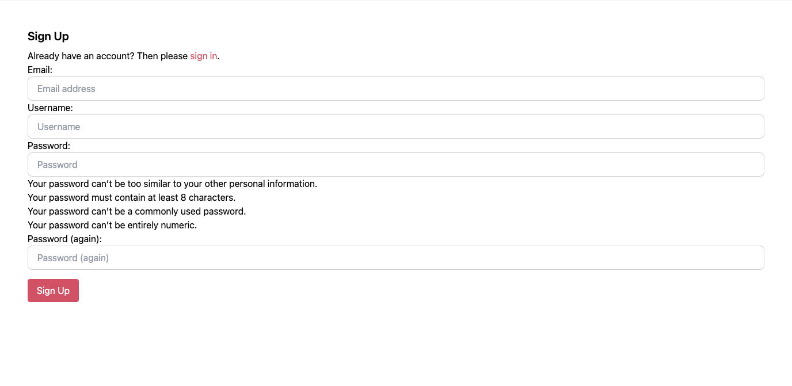
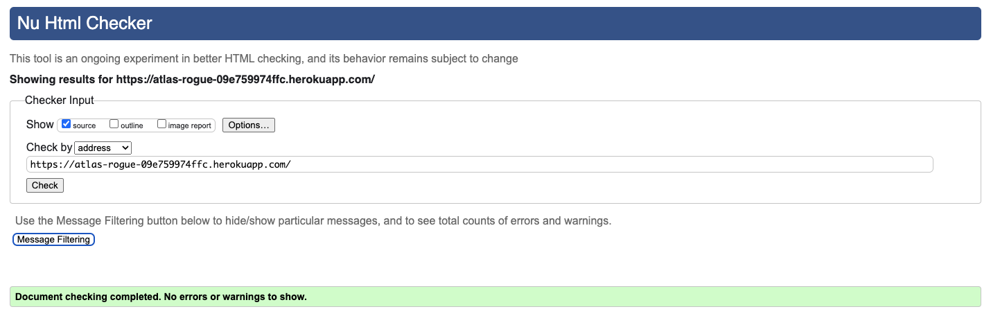

# Atlas Rogue


> [Live Site](https://atlas-rogue-09e759974ffc.herokuapp.com/)

> [Repository](https://github.com/BOM-98/atlas-rogue-project-5)

# Project Background

## Overview

Atlas Rogue is a fashion rental service specializing in women’s clothing in Ireland. Catering primarily to women aged 18-34, Atlas Rogue offers a unique approach by exclusively renting out its own collection of fashionable attire.

The service is designed to provide value and convenience to its customers by offering a broad selection of the latest trends and timeless classics, all available for rent. By maintaining a direct relationship with its customers, Atlas Rogue is able to respond quickly to changing fashion trends and customer preferences, ensuring that its collection remains fresh and relevant. The company leverages exceptional SEO and brand awareness strategies to reach a wide audience, making it easy for customers to find and rent the perfect outfit for any occasion without a hefty price tag.

Atlas Rogue simplifies the fashion rental process, offering a seamless online experience from browsing and selection to rental and return. This direct-to-consumer model not only enhances the shopping experience but also fosters a sense of community among its users, who appreciate the brand's commitment to style, quality, and customer satisfaction.

## Problem Statement

Atlas Rogue addresses the challenge faced by fashion-conscious women aged 18-34 in Ireland who are seeking a sustainable and cost-effective way to access a diverse and trendy wardrobe. Traditional shopping methods often lead to high expenses, closet clutter, and environmental concerns due to fast fashion consumption. Furthermore, the hassle of navigating multiple rental websites to find quality, fashionable clothing items that suit their tastes and needs adds complexity and frustration to the process.

By offering a curated collection of high-quality women's clothing available for rent through a single, user-friendly platform, Atlas Rogue eliminates the need for consumers to buy fast fashion items that are quickly discarded, thus promoting a more sustainable approach to fashion. This service solves the problem of wardrobe diversity without the associated costs and environmental impact, providing a convenient, cost-effective, and eco-friendly solution for staying fashionable.

## Research:


- User Interviews: 1:1 interviews were conducted with existing online fashion rental shoppers to determine the categories they look for, the designers they like and what the pros and cons are of different competing sites in the country. 
- Competitive Analysis: Examining competing rental stores and websites revealed existing offerings and their strengths and weaknesses. This informed our choice of target market, value proposition, messaging and strategy.

## Design

- I began the process by designing wire-frames of the site in order to get an overall understanding of the user flows and necessary pages to achieve the client outcomes.
- I converted the wire-frames into [a figma prototype](https://www.figma.com/file/YWbAEWtNoY8F2MQ9Bu6ytS/Atlas-Rogue-Mockups?type=design&node-id=0%3A1&mode=design&t=QR0umm1zHzCF4fw5-1) to determine the flow, color schemes and typography that would be used.
- The design was then tested with potential customers to ensure they understood the proposition and were able to navigate the prototype without confusion.
- The logo, typeface and colour scheme were chosen to reflect a gentle and kind brand that was not too serious.

<details>
<summary> Mockups </summary>


</details>

<details>
<summary> Colour Palette </summary>


</details>


## Agile Development

Agile software development methods were used to deliver this project and ensure that an iterative approach was taken to achieve the best results for the end-user. 
- The project was broken down from the high level business outcomes and problem statement into epics and user stories. 
- The end user's requirements were written from the end user's perspective to help make sure the right features were being built in a user-centric way.

A github projects board was used to track and manage the expected workload involved in this project, and break it down into a list of epics, and then further into user stories that could be worked towards to build the site on time.
- Each user story was written with a clear description following the convention of "As a ____, I want to ______, so that ____".
- A T-shirt sizing system was used to estimate the effort involved with each story (S, M, L, XL).
- The end user goal and end business goal was clearly articulated on each story, along with the acceptance criteria. 
- Each story contained the necessary tasks required to complete them and achieve the acceptance criteria. 
- #### [Link to the GitHub Project board](https://github.com/users/BOM-98/projects/5)


User stories were prioritized using the MoSCow method (Must have, Should have, Could have, Won't have)
- #### [Link to the MoSCow Prioritization Board](https://github.com/users/BOM-98/projects/5/views/3)

Some user stories relating to ratings and reviews, payment options and customer account management for the website were deemed to not be necessary and therefore were not added to the project. This could be added to the project on a future date.


# Business Model

- Atlas Rogue is an online eCommerce store where customers can rent items of clothing online and have them delivered.
- All clothing items were scraped using the product_scraper.py script from a UK website - [ClOAN STORE](https://www.cloan.uk/).


## Marketing

### SEO

- Keyword research was conducted using [Ubersuggest](https://app.neilpatel.com/en/ubersuggest)
- Given this is a fashion rental site for Ireland keyword research was focused on driving traffic from Irish consumers. Therefore, keyword research was focused heavily on local SEO. 
- Research on UberSuggest showed that the following keywords had significant enough monthly traffic to be worth investing effort to rank for, while having a low enough "SEO Difficulty" i.e. competition to be viable options.
- SEO Difficulty (SD) is on a normalised scale from 1-100, with 100 being the hardest. It is recommended for new websites to aim to target keywords with a SD below 40.
- Long tail keywords that include locations e.g. Cork were added to increase the odds of driving traffic from specific areas in Ireland.
- The top keywords chosen were `dress rental ireland`, `rental dresses ireland` & `rent a dress ireland`.
- These keywords were implemented in the H1 & H2 tags, meta descriptions and titles of pages.
- I attempted not to 'overstuff' keywords in my project and aimed to limit the keywords to max 10 mentions per page.
- I did not have any way to specifically call out `rental dresses dublin` as I did not have inventory I could categorise under than heading. Instead, I attempted to mention Dublin in the about us page and link it to the Homepage twice so that the "link juice" flowed to the homepage and at least give a chance of it ranking on the first page of the keyword term.
- Whenever possible, important keywords were bolded to highlight their importance and increase chances of them ranking. 
- The word `dress` was included in the majority of our product names for dresses, therefore I made sure that the image names matched the name of the item and included the item name in the alt attributes of any image to increase our rankings for the word `dress`.
- A `sitemap.xml` and `robot.txt` file was generated and uploaded to the project to inform Google what pages should be indexed and maximize chances of Atlas Rogue ranking for our targeted keywords.

<hr>

| KEYWORD                 | VOLUME | SD |
|-------------------------|--------|----|
| `rental dresses dublin` | 1900   | 29 |
| `dresses to rent dublin`| 1900   | 30 |
| `dress rental dublin`   | 1900   | 30 |
| `rent dresses dublin`   | 1900   | 30 |
| `rent dress dublin`     | 1900   | 30 |
| `rent a dress dublin`   | 1900   | 29 |
| `rent dress ireland`    | 1600   | 22 |
| `dress rental ireland`  | 1600   | 28 |
| `rental dresses ireland`| 1600   | 22 |
| `rent a dress ireland`  | 1600   | 25 |
| `rent dresses ireland`  | 1600   | 28 |
| `dresses to rent ireland`| 1600  | 28 |
| `rental dresses`        | 480    | 21 |
| `dress rental`          | 480    | 22 |
| `rent dresses`          | 480    | 22 |
| `rent a dress`          | 480    | 26 |
| `dresses rental`        | 480    | 21 |
| `dress rentals`         | 480    | 20 |
| `dress rental cork`     | 210    | 30 |


<details>
<summary>Screenshot of Ubersuggest Report</summary>


</details>

<hr>

### Social

- A fictional Facebook business page was set up for the eCommerce store which offers several advantages:

<details>
<summary>Facebook Page Screenshot</summary>


</details>


- Using a Facebook business page to promote Atlas Rogue, offers a multitude of benefits in terms of digital marketing and customer interaction.

  - **Increased Visibility:**
  Broad Audience Reach: Facebook's vast user base provides an unparalleled platform to reach a wide audience globally. This increased visibility can lead to higher brand recognition and potentially more customers.

  - **SEO Benefits:** A well-maintained Facebook page can also enhances our SEO efforts, giving Google signals that this is a legitimate business and providing more trust scores on its EAT criteria to make it more visible in search engine results pages (SERPs) when people search for related keywords.

  - **Customer Engagement:**
  Direct Communication: Facebook allows for real-time interaction with our audience through comments, messages, and posts, fostering a stronger connection between your brand and its followers.

  - **Marketing Opportunities:**
  Targeted Advertising: Facebook's advertising platform enables highly targeted campaigns based on demographics, interests, and behavior, allowing you to reach specific segments of your audience with customized messages.

  - **Content Sharing:** The platform is ideal for sharing a wide range of content, including updates, promotions, educational content, and behind-the-scenes looks, which can engage and inform your audience.

  - **Brand Building:** Consistent Brand Image: A Facebook business page serves as an extension of Atlas Rogue's, allowing us to maintain a consistent brand image and voice across all your marketing channels.

  - **Community Building:** Through features like Facebook Groups, Facebook enables us to foster a community around our Brand or Clothing Rentals in general.

  - **Customer Support:**
  Immediate Response: Facebook messaging is an increasingly more popular channel through which customers contact businesses with queries or complaints.


## Newsletter

- A newsletter form is present on the footer of every page, which offers a variety of benefits:

  - **Lead Generation:**
    The newsletter sign-up form serves as a powerful tool for capturing the contact information of potential customers. By encouraging visitors to subscribe, Atlas Rogue can grow its database of leads who have expressed interest in their rental service, laying the groundwork for targeted marketing campaigns and personalized offers.

  - **Direct Communication:**
    Subscribing to the newsletter allows Atlas Rogue to establish a direct line of communication with its audience. This channel can be used to send updates, promotions, exclusive offers, and fashion tips directly to subscribers' inboxes, fostering a stronger connection between the brand and its customers.

  - **Customer Retention:**
    Regular newsletters keep subscribers engaged and informed about the latest additions to the collection, special events, and any loyalty programs. This consistent touch point increases the likelihood of subscribers returning to Atlas Rogue for their rental needs, enhancing customer retention.

  - **Traffic and Engagement:**
    Newsletters can drive traffic back to the Atlas Rogue website by featuring captivating content, such as new arrivals, fashion inspiration, and exclusive deals. Increased website visits not only boost engagement but also provide more opportunities for conversions and sales.

  - **Analytics and Insights:**
    Every newsletter campaign offers actionable analytics, such as open rates, click-through rates, and conversion data. Atlas Rogue can use these insights to understand subscriber preferences better, refine marketing strategies, and tailor future content to meet the interests and needs of their audience more effectively.


## Data Models

The database schema for the Atlas Rogue site is shown below:


<details>
<summary>Orders Model</summary>

### `orders`
- `order_number` varchar(32) [primary key]
- `user_profile_id` integer [null]
- `full_name` varchar(50)
- `email` varchar(254)
- `phone_number` varchar(20)
- `country` varchar
- `postcode` varchar(20) [null]
- `town_or_city` varchar(40)
- `street_address1` varchar(80)
- `street_address2` varchar(80) [null]
- `county` varchar(80) [null]
- `date` timestamp
- `delivery_cost` decimal(6,2)
- `order_total` decimal(10,2)
- `grand_total` decimal(10,2)
- `original_bag` text
- `stripe_pid` varchar(254)

</details>

<details>
<summary>Order Line Items Model</summary>


### `order_line_items`
- `id` integer [primary key]
- `order_id` integer
- `product_id` integer
- `quantity` integer
- `lineitem_total` decimal(6,2)

</details>

<details>
<summary>Product Rentals Model (Custom)</summary>

### `product_rentals`
- `id` integer [primary key]
- `product_id` integer
- `order_line_item_id` integer
- `start_date` date
- `end_date` date

</details>

<details>
<summary>User Profiles Model</summary>

### `user_profiles`
- `id` integer [primary key]
- `user_id` integer
- `default_phone_number` varchar(20) [null]
- `default_street_address1` varchar(80) [null]
- `default_street_address2` varchar(80) [null]
- `default_town_or_city` varchar(40) [null]
- `default_county` varchar(80) [null]
- `default_postcode` varchar(20) [null]
- `default_country` varchar(40) [null]

</details>

<details>
<summary>Contacts Model (Custom)</summary>

### `contacts`
- `id` integer [primary key]
- `name` varchar(100)
- `email` varchar(254)
- `subject` varchar(150)
- `message` text
- `created_at` timestamp

</details>

<details>
<summary>Categories Model</summary>

### `categories`
- `id` integer [primary key]
- `name` varchar(254)
- `friendly_name` varchar(254) [null]

</details>

<details>
<summary>Products Model</summary>

### `products`
- `id` integer [primary key]
- `category_id` integer [null]
- `sku` varchar(254) [null]
- `name` varchar(254)
- `designer` varchar(254) [null]
- `price` decimal(6,2)
- `rrp` decimal(6,2) [null]
- `size` varchar(254) [null]
- `colour` varchar(254) [null]
- `length` varchar(254) [null]
- `image_url` varchar(1024) [null]
- `image` varchar [null] 

</details>

<details>
<summary>Wishlist Model (Custom)</summary>

### `wishlists`
- `id` integer [primary key]
- `user_profile_id` integer

</details>


# Features

## CRUD functionality:

### Member CRUD Functionality
- Create:
  - Users can create a `User` with an associated `User Profile` on the register page
  - Users can create `Orders`, `Product Rentals` & `Order Line Items` for a rental item through the checkout
  - Users can create `Wishlist` items by clicking the wishlist button on products
  - Users can create `Contacts` through the contact us form on the contact page
- Read: 
  - Users can read their `Orders`, `Product Rentals` & `Order Line` Items information on their profile page in Order History
  - Users can read all `Wishlist` items in their account
  - Users can read all `Products` and `Categories` through the products and product details pages
- Update: 
  - Users can update the `User` account with the profile page and form
### Admin CRUD Functionality
- Create:
  - Admins can create `Products` through the product management page
- Read: 
  - Admins can read all of the `Contacts` that have been submitted by users on the Contact Form Submissions page
- Update: 
  - Admins can update `Products` on the site by clicking the edit button under any product in the products or product_detail pages
- Delete:
  - Admins can delete `Products` from the site by clicking the delete button under any product in the products or product_detail pages


## Authentication / Authorization:

Certain access restrictions were put in place across the website. 

### No Login Required

- Homepage is viewable by everyone 

### Must Be Logged Out To View

Only users who are not logged in can view:
- The registration page to register an account
- The login page to login to their account

If a user is logged in and navigates to these pages they should be redirected to the homepage


### Login Required:

Logins are required on a user account in order to access these pages:
- Profile page - `profile.html`
- Wishlist page - `wishlist.html`

### User Authentication
- Users are only able to see Orders that they have made - `checkout_success.html`

### Admin Only Access: 

Only users logged in with an admin account can access these pages:

- Add Product page - `add_product.html`
- Update Product page - `edit_product.html`
- Contact Form Submissions page - `contact_form_submissions.html`

## General Features:

### Navigation & Footer

- A primary navigation is present on the header on all pages of the website. The top navigation is entirely custom built to fit with the style and design of the brand and **does not use any other pre-built components from other libraries**. 

- If a user is logged in as an admin, the user has access to all available navigation links including Product Management and Contact Form Submissions which are not available to regular users

<details>
<summary>Screenshot of Admin Navigation</summary>


</details>
<br>

- If the user is logged in as a regular customer, the user has access to their profile, cart, wishlist and all standard navigation links. 

<details>
<summary>Screenshot of Member Navigation</summary>


</details>
<br>

- The navigation collapses into a burger menu on mobile screens
<details>
<summary>Screenshot of Collapse Menu</summary>


</details>
<br>

The footer is present on all screens of the website and follows the same conditional login for presenting links as the primary navigation

<details>
<summary>Footer Navigation</summary>


</details>
<br>

### Homepage

The homepage acts as an advertising front for any visitors who are not currently members. The copy on the homepage will be optimised for SEO keywords to win search traffic from people searching for dress rentals in Ireland.

<details>
<summary>Screenshots of The Homepage</summary>


</details>

### Login & Register

Login and register pages were implemented to manage user signups and contact/delivery details.

The website collects `email`, `username` and `password` through the registration form. 

Form validation ensures that no username can be used twice.

<details>
<summary>Screenshot of The Register Form</summary>



</details>
<br>
<details>
<summary>Screenshot of The Login Form</summary>


</details>

### Error Pages

A custom error page was added to handle 400 errors. 

<details>
<summary>Screenshot of The 404 Page</summary>


</details>

## Admin Features:

### Add Products

Admin users can add products to the website through the `add products` tab.

<details>
<summary>Screenshot of the Add Products Tab</summary>


</details>

### Edit & Delete Products

Admin users can update and delete links from their account seen on the the `products` and `product_detail` pages.

<details>
<summary>Screenshot of the products page with update & delete links</summary>


</details>

### Contact Form Submission Views

Admin users can view their contact form submissions from the Contact Form Submissions page. Submissions are presented as a table. 

<details>
<summary>Screenshot of the Form Submissions Page</summary>


</details>


## Customer Features: 

All customers can see the following pages

### Products Page

Customers can browse all products in our inventory through `products.html`. Customers can search for products by keyword in the search bar in the navigation or filter/sort products by using the tabs across the top of the page. 

<details>
<summary>Screenshot of The Products Page</summary>


</details>

### Products Detail Page

Customers can see a more detailed view of their products through the `products_detail.html` page. Here customers can view the `designer`, `name`, `price` (daily), `RRP`, `size`, `color` and `length` of each item. They can select their rental period using the datetime pickers on the page and add their items to the cart.

Datetime pickers have form validation implemented to ensure they are inputted. Datetime pickers also prevent users from selecting impossible dates including dates earlier than today and setting an end date that is before the start date.

<details>
<summary>Screenshot of The Product Detail Page</summary>


</details>

### Add To Cart Toast

Customers receive a success notification with an update on items in their cart whenever they add a new item to their bag.

<details>
<summary>Screenshot of Add To Cart Toast</summary>


</details>

### Cart

Customers view, edit and delete all items they have in their cart. Their cart also gives them up-to-date information on the number of items they have, the rental periods and days rented, their shipping fee and their grand total. 

<details>
<summary>Screenshot of Cart</summary>


</details>

### Checkout

Customers are prompted to enter or confirm their personal information, including name, email, and contact number. If the customer is already logged in, this information can be auto-filled from their account details.

A secure Stripe payment gateway is integrated, allowing customers to enter their payment details with confidence.

Form validation is implemented to ensure all fields are inputted before completing the order.

<details>
<summary>Screenshot of Checkout</summary>


</details>

### Order Confirmation

Upon successful completion of their checkout customers receive an order confirmation.

<details>
<summary>Screenshot of Confirmation</summary>


</details>

### Contact Form

Customers can contact Atlas Rogue through our contact form, reachable from the top navigation and the footer. The form includes `name`, `email`, `subject` and `message` fields. 

<details>
<summary>Screenshot of Contact Form</summary>


</details>

### Customer Profile

Customers can view and update their profile information, along with their order history, from the Profile page. The profile contains update functionality to add profile information in addition to reading their Order history. 

<details>
<summary>Screenshot of Profile Page</summary>


</details>

### Wishlist

Customers who are logged into an account can add items to their wishlist which is viewable from the Wishlist page. To add items customers click the heart icons next to any product and can then navigate to the wishlist page by clicking the heart in the top navigation. On the wishlist page customers can proceed to remove items from their wishlist by clicking the now 'full' heart icon or they can proceed to add them to their cart.

<details>
<summary>Screenshot of Wishlist</summary>


</details>

## Roadmap

### Social Media Logins

It is intended to add functionality to allow members register and login using social media authentication from google and meta. This would significantly reduce the friction on sign-up for new members and improve the conversion rate of web visitors to members.  

### Google Maps Integrations

Atlas Rogue would benefit from assigning an address to it's website for SEO purposes. A physical address listed, particularly on the contact or about page, should help improve how Atlas Rogue gets reviewed by Google Search. 

### Implement A Blog 

Atlas Rogue wants to stand out as a voice of authority in Ireland on the topic of fashion rental and sustainable fashion. Informational blog posts will add an element of credibility to the company and also help Atlas Rogue rank higher on Google/Bing for targeted keywords mentioned in blog articles. Articles, if well written, should help secure additional back-links to the site from people who want to cite or share our points of view, therefore increasing our domain authority. 

# Bugs

## Bug 1: Bag Contexts.py Creating an Error on Local Deployment:

I updated my contexts.py file in my bag when trying to add the ability to store rental periods, and this impacted my site as my cart was trying to fetch a quantity number that was an int when I had changed it to a dictionary to store two dates. This repeatedly caused my program to crash locally, but not in production. Even when I cleared my cookies and corrected the bug in my codebase this issue persisted, and I could only run my program locally in an incognito browser. 


## Bug 2: Stripe Payments Webhook Not Working: 
When I implemented Stripe payments at first, the checkout would process a card payment and generate a payment intent but the payment.intent.succeeded webhook from Stripe would never succeed. This prevented the site from sending confirmation emails to the customer once the order was made. Eventually I found that I had not included a code snippet mentioned in one of the  walkthroughs due to Stripe updating it's API recently. The code snippet is included below: 

```

intent = event.data.object
pid = intent.id
bag = intent.metadata.bag
save_info = intent.metadata.save_info

stripe_charge = stripe.Charge.retrieve(
    intent.latest_charge
)

billing_details = stripe_charge.billing_details # updated
shipping_details = intent.shipping
grand_total = round(stripe_charge.amount / 100, 2) # updated

```

Once the following update was made my Stripe webhook started working as intended.

# Technologies Used

I outline the different technologies involved in this project and the purpose for using each technology in this section.

## Core Technologies

- [Django](https://www.djangoproject.com/) the full stack framework used for this website.
- [JavaScript](https://www.ecma-international.org/publications-and-standards/standards/ecma-262/) used for rendering the fullcalendar calendar in the app.
- [HTML](https://html.spec.whatwg.org/)/[CSS](https://www.w3.org/Style/CSS/Overview.en.html) + [Django Template Language](https://docs.djangoproject.com/en/4.2/ref/templates/language/) used for building templates on the website and rendering data from the database on the webpages.

## Frameworks and Packages


- [Tailwind](https://tailwindcss.com/) - CSS library used to style the site.
- [Flowbite](https://flowbite.com/) - Tailwind CSS component library.
- [jQuery](https://jquery.com/) - JavaScript library for document transversal and manipulation.


## Django Packages

- [Gunicorn](https://pypi.org/project/gunicorn/) - provides HTTP server.
- [psycopg2](https://pypi.org/project/psycopg2/) - provides PostgreSQL connection.
- [Pillow](https://pypi.org/project/Pillow/) - used for image processing (Model ImageField).
- [Whitenoise](https://pypi.org/project/whitenoise/) - used for serving static files.
- [Coverage](https://pypi.org/project/coverage/) - used for testing and analysis.
- [Django Storages](https://django-storages.readthedocs.io/en/latest/) and [Boto3](https://pypi.org/project/boto3/) - used for storing static files and media files on AWS S3.
- [Django Crispy Forms](https://django-crispy-forms.readthedocs.io/en/latest/) and [Tailwind Crispy Forms](https://github.com/django-crispy-forms/crispy-tailwind) were used to style forms in this project. 
- [Black](https://pypi.org/project/black/) - A PEP8 compliant code formatter.


## Deployment Technologies

- [PostgreSQL](https://www.postgresql.org/) (via Elephant SQl) - used for database.
- [Heroku](https://www.heroku.com/) - used for hosting the application.
- [AWS S3](https://aws.amazon.com/s3/) - used for storing static files and media files.
- [Github](https://github.com/) - code repository for storing the codebase and version control

## Integrated Technologies:
 - [Stripe Elements](https://docs.stripe.com/payments/quickstart) was used to implement a PCI compliant checkout.

# Testing

## Manual Testing

### General Tests

| Test                                  | Action                                                                                       | Result |
| ------------------------------------- | -------------------------------------------------------------------------------------------- | ------ |
| URL loads                             | Enter the website URL into a browser and press Enter.                                        | PASS   |
| Page loads in under 3 seconds         | Measure the load time of the page from the moment the URL is entered.                        | PASS   |
| Navigation links all work             | Click each navigation link in the header and verify it directs to the correct page.          | PASS   |
| All CTA Links work                    | Click each Call to Action (CTA) link and verify it performs the expected action.             | PASS   |
| All footer navigation links work      | Click each navigation link in the footer and verify it directs to the correct page.          | PASS   |
| Facebook link opens to a different page | Click Facebook media link and verify it opens the correct social media page in a new tab. | PASS   |

### Homepage Testing

| Test                                  | Action                                                                                     | Result |
| ------------------------------------- | ------------------------------------------------------------------------------------------ | ------ |
| Logo link works                       | Click on the website's logo to ensure it redirects to the homepage.                        | PASS   |
| Page loads in under 3 seconds         | Time the page load from when the URL is entered to when the page is fully loaded.          | PASS   |
| Navigation links all work             | Test each navigation link in the site's menu to confirm they lead to the correct pages.    | PASS   |
| All CTA Links work                    | Click on each Call to Action button/link and check it leads to the expected response/page. | PASS   |
| All footer navigation links work      | Verify each link in the footer to ensure they navigate to the correct sections or pages.   | PASS   |
| Social link opens to a different page | Click the social media icons and check if they open the correct profiles in new tabs.      | PASS   |
| All products link to the right page | Click each product in the featured section and ensure that the right product page is opened.      | PASS   |
| Wishlist links work | Click each wishlist icon and check the item gets added to the wishlist and the heart becomes full. Click again to remove the item from wishlist and see and empty heart.      | PASS   |

### Login & Register Page Testing

| Forms create a new user                          | Complete and submit the registration form with valid details.                              | PASS |
| ------------------------------------------------ | ------------------------------------------------------------------------------------------ | ---- |
| Form validation prevents missing fields          | Submit forms with some fields left blank to test required field validation.                | PASS |
| Form validation prevents duplicate users         | Attempt to register a user with a username that already exists.                   | PASS |
| Password validation prevents easy passwords      | Try to create a user with common passwords to test the strength validation.                | PASS |
| Password confirmation prevents mismatched fields | Enter mismatched passwords in the 'password' and 'confirm password' fields.                | PASS |
| User can login with a valid account              | Attempt to login with correct user credentials.                                            | PASS |
| User can't login with an invalid account         | Attempt to login with incorrect user credentials.                                          | PASS |
| Error messages for invalid forms display         | Submit invalid forms to ensure that appropriate error messages are displayed.              | PASS |
| Login link on register form redirects            | Click the login link on the registration form to ensure it redirects to the login page.    | PASS |
| Register link on login form redirects            | Click the register link on the login form to ensure it redirects to the registration page. | PASS |
| Register form sends a confirmation email to the user | Ensure that customers that register receive an email confirmation | PASS |

### Bag/Cart Testing

| Test                                          | Action                                                            | Result |
|-----------------------------------------------|-------------------------------------------------------------------|--------|
| View cart page without items                  | Navigate to cart page without adding any product to the cart      | Pass   |
| Add a single product to cart                  | Find a product and add it to the cart                             | Pass   |
| Remove a product from the cart                | Remove an item from the cart                                      | Pass   |
| Add multiple products to cart                 | Add several different products to the cart                        | Pass   |
| Add the same product multiple times to cart   | Add the same product to the cart multiple times - the product should just change dates                   | Pass   |
| View updated subtotal after adding items      | Check if the cart's subtotal updates after adding/removing items  | Pass   |
| Proceed to checkout with items in the cart    | Click on proceed to checkout with items in the cart               | Pass   |
| Update rental dates in the cart from product page | Change the rental dates of a product from its product detail page to the cart | Pass |
| Save cart items for logged-in user            | Log in, add items to cart, log out, log back in, and view cart    | Pass   |
| Cart is empty for a new session               | Open a new browser session and check if the cart is empty         | Pass   |
| Cart items persist after browser refresh      | Refresh the browser page and check if cart items persist         | Pass   |
| Cart redirects with error message if empty and proceeding to checkout     | Keep the cart empty, press the checkout button         | Pass   |


### Checkout Page

| Test                                          | Action                                                                    | Result |
|-----------------------------------------------|---------------------------------------------------------------------------|--------|
| Access checkout page with items in cart       | Navigate to checkout page with items in the cart                          | Pass   |
| Fill in personal information                  | Enter personal details in the form fields                                 | Pass   |
| Fill in shipping information                  | Enter shipping details in the form fields                                 | Pass   |
| Enter payment information                     | Fill in payment details using a test credit card provided by Stripe       | Pass   |
| Complete purchase                             | Submit the checkout form to complete the purchase                         | Pass   |
| Display success message after purchase        | Verify that a success message or confirmation page appears after purchase | Pass   |
| Redirect to checkout success page after purchase     | Check if the user is redirected to the checkout success page after purchase   | Pass   |
| Save order in user's order history            | For logged-in users, check if the order appears in their order history    | Pass   |
| Validate form fields                          | Check required fields for validation and display error messages           | Pass   |
| Responsive design for mobile devices          | Test the checkout page on various mobile devices for responsiveness       | Pass   |


### Products Page

| Test                                      | Action                                                                | Result |
|-------------------------------------------|-----------------------------------------------------------------------|--------|
| Display all products                      | Navigate to the products page to check if all products are displayed  | Pass   |
| Product filtering by category             | Select a category and verify only products from that category appear  | Pass   |
| Product search functionality              | Use the search bar to find products by keywords                       | Pass   |
| Detailed product view                     | Click on a product to view its detailed page                          | Pass   |
| Sort products                             | Sort products by different criteria (e.g., price, name)               | Pass   |
| Responsive design                         | Test the products page on various screen sizes for responsiveness    | Pass   |
| Filter products by price range            | Use a price filter to display products within a specific price range  | Pass   |
| Display number of products found          | Verify the total number of products found is displayed                | Pass   |
| Wishlist links work | Click each wishlist icon and check the item gets added to the wishlist and the heart becomes full. Click again to remove the item from wishlist and see and empty heart.      | PASS   |


### Payments

| Test | Action | Result |
|------|--------|--------|
| NLI can successfully make a payment & order | A not-logged-in user (NLI) attempts to make a payment and order | Pass |
| LIU can successfully make a payment & order | A logged-in user (LIU) attempts to make a payment and order | Pass |
| If payment is successful user will be redirected to order success page | After a successful payment, check if the user is redirected to an order success page | Pass |
| If order fails due to incorrect information being submitted order will not be submitted | Attempt to submit an order with incorrect information and verify it does not get processed | Pass |
| If there is an error when processing the order the site returns a 500 error without processing order | Introduce an error in order processing and verify that a 500 error is returned without the order being processed | Pass |
| Payment method validation failure results in error message | Enter an invalid payment method and verify that an appropriate error message is displayed | Pass |
| Correct currency is charged for the payment | Verify that the payment is processed in the correct currency as displayed on the checkout page | Pass |

### Wishlist
| Test | Action | Result |
|------|--------|--------|
| LIU can add a product to wishlist | A logged-in user (LIU) attempts to add a product to their wishlist | Pass |
| LIU can view products in wishlist | A logged-in user navigates to the wishlist page to view added products | Pass |
| LIU can remove a product from wishlist | A logged-in user removes a product from their wishlist | Pass |
| Wishlist retains products after logout and login | A user adds products to wishlist, logs out, then logs back in to check persistence | Pass |
| NLI cannot access wishlist | A not-logged-in user (NLI) attempts to access the wishlist feature | Pass |
| LIU can add a product from wishlist to cart | A logged-in user adds a product from their wishlist directly into their cart | Pass |
| Wishlist page is responsive on mobile devices | Access the wishlist page on various mobile devices and verify responsiveness | Pass |
| Duplicate products cannot be added to wishlist | Attempt to add the same product multiple times to the wishlist | Pass |
| Wishlist updates reflect immediately without page refresh | Modify the wishlist (add/remove items) and verify changes reflect immediately | Pass |
| Products in wishlist show relevant details | Verify that products in the wishlist display necessary details like name, price, etc. | Pass |
| Empty wishlist shows a meaningful message | Navigate to the wishlist page without any products and check for a message | Pass |
| LIU can move products between wishlist and cart | Move a product from the wishlist to the cart and vice versa | Pass |
| Wishlist icon/count updates in real-time | Verify the wishlist icon or count updates as products are added or removed | Pass |
| Product details accessible from wishlist | Click on a product in the wishlist to view its detailed page | Pass |

### Profile

| Test                                         | Action                                                                                           | Result |
|----------------------------------------------|--------------------------------------------------------------------------------------------------|--------|
| User's Profile details in profile page is Correct                 | Verify that the displayed fields matches the user's actual fields in their profile.     | PASS   |
| Email Address Verification                   | Ensure the displayed email address is correctly associated with the user's account.             | PASS   |
| Wishlist Count is Accurate                   | Confirm that the wishlist count reflects the actual number of items in the user's wishlist.     | PASS   |
| Navigate to Wishlist from Profile            | Click on a link or button from the user profile to navigate to the wishlist page.               | PASS   |
| Product Addition to Wishlist                 | Add a product to the wishlist and verify it appears within the user's wishlist.                 | PASS   |
| Remove Product from Wishlist                 | Remove a product from the wishlist and confirm the list updates accordingly.                   | PASS   |
| Edit Profile Directs Correctly               | Use the "Edit Profile" option and verify redirection to the profile update page.                | PASS   |
| Log Out Functionality                        | Click the "Log Out" button and confirm the user is successfully logged out.                     | PASS   |
| Update User Information                      | Update user information (e.g., name, email) and verify changes are reflected.                   | PASS   |
| See Orders Link Directs to Orders Page       | Click on the "See Orders" link and check if it redirects to the user's orders page.             | PASS   |
| Order History Matches User Activity          | Verify the order history correctly lists all past orders made by the user.                      | PASS   |
| Product Detail Accessibility from Wishlist   | Select a product in the wishlist and ensure it directs to the detailed product page.            | PASS   |
| Mobile Responsiveness of User Profile Page   | Access the user profile page on a mobile device to test for responsive design.                  | PASS   |


## Pagespeed Insights Report

Pagespeed Insights & Lighthouse testing revealed perfect results for of the website across all dimensions except Performance which was amber.

<br>

> index.html


<details>
<summary>Pages Tested List:</summary>

- bag.html
- checkout.html
- checkout_success.html
- contact.html
- contact_submissions.html
- about_us.html
- add_product.html
- edit_product.html
- product_detail.html
- products.html
- profile.html
- wishlist.html
- 400.html

</details>

## Responsiveness Testing

- ResponsivelyApp and Chrome Dev Tools were used to test responsiveness.
- The website underwent comprehensive testing in both portrait and landscape orientations across a variety of simulated mobile, tablet, and large format screen sizes.
- All pages were tested across browsers for full responsiveness. 

<br>
<details>
<summary>Homepage Responsive Checking</summary>


</details>

## Code Validation

### HTML

All HTML code was put through the [W3 HTML Validator](https://validator.w3.org/nu/) and passed.
<br>

> homepage.html

<details>
<summary>Pages Checked List:</summary>

- bag.html
- checkout.html
- checkout_success.html
- contact.html
- contact_submissions.html
- about_us.html
- add_product.html
- edit_product.html
- product_detail.html
- products.html
- profile.html
- wishlist.html
- 400.html

</details>

### CSS

All CSS code was put through the [W3 CSS Validator](https://jigsaw.w3.org/css-validator/) and passed.
<br>

> profile.css

<details>
<summary>Pages Checked List:</summary>

- profile.css
- checkout.css

</details>

### Python

All python code was put through the [Code Institute Python Linter](https://pep8ci.herokuapp.com/#) and passed

### Javascript

All code was put through the [https://www.jsvalidator.com](jsvalidator.com) and returned no errors.

<details>
<summary>JS Files Checked List:</summary>

- Stripe_elements.js
- countryfield.js
- cart.js
- Datepicker_config.js
- index.js
- navButton.js

</details>

<br>

# Deployment

### ElephantSQL Database

> This project uses [ElephantSQL](https://www.elephantsql.com) for the PostgreSQL Database.

To obtain your own Postgres Database, sign-up with your GitHub account, then follow these steps:
- Click **Create New Instance**.
- Provide the name of your project e.g. `Atlas-Rogue`
- Select the **Tiny Turtle (Free)** plan.
- Choose your **Data Center** e.g. `eu-west-1 (Ireland)` 
- Click "Review"
- Once you have checked your details, click "Create Instance"
- Once created, click on the new database name, where you can view the database URL and Password.
 - On the details page of your Instance, copy the URL beginning with `postgres://` and Paste your ElephantSQL url in your env.py file
 - Make sure to include your URL in your Heroku app settings as outlined in the Heroku section below

### AWS S3 

- This project utilizes [Amazon Web Services (AWS) S3](https://aws.amazon.com/s3/) for storing static and media files.
- Sign up or log into your AWS account at [AWS](https://aws.amazon.com/).
- Navigate to the S3 service in the AWS Management Console.
- Click **Create bucket**. Name your bucket, select a region, uncheck "Block all public access", acknowledge the public access, and create the bucket.
- In your bucket settings, go to the **Permissions** tab.
- Under **Bucket Policy**, click **Edit** and input a policy to allow public read access. Example:
  ```json
  {
      "Version": "2012-10-17",
      "Statement": [{
          "Sid": "PublicReadGetObject",
          "Effect": "Allow",
          "Principal": "*",
          "Action": "s3:GetObject",
          "Resource": "arn:aws:s3:::YOUR_BUCKET_NAME/*"
      }]
  }
- Replace YOUR_BUCKET_NAME with your actual bucket name.
- Within the Permissions tab, select Static website hosting.
- Opt for "Use this bucket to host a website" and set index and error documents as needed.
- Go to IAM (Identity and Access Management) service.
- Click Add user, choose a name, select Programmatic access, and attach the AmazonS3FullAccess policy.
- Important: Download the provided CSV file with the access key ID and secret access key.
- Install required packages: boto3 and django-storages.

### Heroku

> This project uses [Heroku](https://www.heroku.com)

To deploy to Heroku I followed these steps: 

- Sign up or login on Heroku
- Create a new app in Heroku by selecting "New" and "Create New App" from the admin dashboard homepage
- Choose your name e.g. `atlas-rogue` as the name for the project and chose your region e.g. `EU`
- Confirmed creation of a new app
- Navigate to the submenu in the navigation bar and select "resources"
- From here I was redirected to the Deploy tab
- Navigate to Settings and click the "Reveal Config Vars" button
- Create a new Key Value pair with the key of "CLOUDINARY_URL" and the value of the Cloudinary url in the .env file of the app repository
- Create a second Key Value pair with the key of "DATABASE_URL" and the value of the Elephant SQL url in the .env file of the app repository
- Create a third Key Value pair with a value of "SECRET_KEY" and the value of the SECRET_KEY variable in your .env file of the app repository
- Create one more Key Value pair with the value of PORT and a Key of 8000

| Key | Value |
| --- | --- |
| `AWS_ACCESS_KEY_ID` | user's own value |
| `AWS_SECRET_ACCESS_KEY` | user's own value |
| `DATABASE_URL` | elephant sql url |
| `EMAIL_HOST_PASSWORD` | user's own value |
| `EMAIL_HOST_USER` | user's own value |
| `SECRET_KEY` | user's own value |
| `STRIPE_PUBLIC_KEY` | users' own public key |
| `STRIPE_SECRET_KEY` | users own' secret key |
| `STRIPE_WH_SECRET` | stripe webhook endpoint |
| `USE_AWS` | True |

- Heroku needs two additional files in order to deploy properly.
  - requirements.txt
  - Procfile

>You can install this project's requirements (where applicable) using:
```
>pip3 install -r requirements.txt
>If you have your own packages that have been installed, then the requirements file needs >updated using:

>pip3 freeze --local > requirements.txt
>The Procfile can be created with the following command:

>echo web: gunicorn app_name.wsgi > Procfile
>replace app_name with the name of your primary Django app name; the folder where settings.py is located
```

- In the Settings tab, ensure that the Python Buildpack is added.
- In the Deploy tab, enable automatic deploys from the Github repository
- Click "Deploy Branch" to deploy the app
- Once the app has been built, click "open app" in the top right corner to test deployment


### Local Deployment

#### Forking the repository

By forking the GitHub Repository you can make a copy of the original repository to view or change without it effecting the original repository.
You can do this by: 
-  Logging into GitHub or create an account. 
- Locate the repository at  [here](https://github.com/BOM-98/atlas-rogue-project-5)  . 
-  At the top of the repository, on the right side of the page, select "Fork" from the buttons available. 
-  A copy of the repository should now be created in your own repository.

#### Create a clone of this repository

Creating a clone enables you to make a copy of the repository at that point in time - this lets you run a copy of the project locally: This can be done by:

-   Navigate [Here](https://github.com/BOM-98/atlas-rogue-project-5)
-   click on the arrow on the green code button at the top of the list of files
-   select the clone by https option and copy the URL it provides to the clipboard
-   navigate to your code editor of choice and within the terminal change the directory to the location you want to clone the repository to.
-   type 'git clone' and paste the https link you copied from github
-   press enter and git will clone the repository to your local machine
-   In the terminal install the requirements by using the following: pip3 install -r requirements.txt
-   Next create the env.py file which tells our project which variables to use.  
-   Add the file to a .gitignore to prevent it from being pushed to github
-   Add the following variables to your env.py file
```
python
DEBUG=FALSE #django debug mode
SECRET_KEY= #your django secret key
STRIPE_PRIVATE_KEY= #your stripe private key
DATABASE_URL= #your postgres database URL
USE_S3=True
AWS_ACCESS_KEY_ID= #AWS access key
AWS_SECRET_ACCESS_KEY= #AWS secret access key
AWS_STORAGE_BUCKET_NAME= #name of your S3 storage bucket
AWS_S3_CUSTOM_DOMAIN= #your aws domain
```
-   Make migrations by running :  `python manage.py makemigrations`
-   Then migrate those changes with  `python manage.py migrate`
-   To run the project type  `python manage.py runserver` into the terminal and open port 8000.

<br>

# Credits CHANGE

## Courses & Tutorials

- This Codecademy Skill Path was used to learn the ins and outs of Django concepts [Codecademy Course](https://www.codecademy.com/learn/paths/build-python-web-apps-with-django)

- Organising project boards - [Youtube video describing project boards](https://www.youtube.com/watch?v=C0RTISXqyAk)

## Articles & Guides

- [Setting up the project boards, issues and milestones](https://www.topcoder.com/thrive/articles/project-management-on-github)
- Recommended text sizes [Typeography](https://learnui.design/blog/mobile-desktop-website-font-size-guidelines.html)
- [Tailwind CSS Walkthrough](https://www.youtube.com/watch?v=76n7sqZocSk)
- [Tailwind CSS Documentation](https://django-tailwind.readthedocs.io/en/latest/installation.html)
- [Ui color creator](https://uicolors.app/create)
- [Django signals](https://docs.djangoproject.com/en/4.2/topics/signals/)
- product_scraper.py creation [Scraping Product Information](https://www.youtube.com/watch?v=MeBU-4Xs2RU)
- [Shopping Cart Base Template](https://codepen.io/abdelrhman/pen/BaNPVJO)
- [CrispyTailwind](https://github.com/django-crispy-forms/crispy-tailwind)
- [Securing against unauthorized access](https://www.codu.co/articles/securing-django-views-from-unauthorized-access-npyb3to_)
- [Designer sections on homepage template](https://tw-elements.com/snippets/tailwind/tailwindelements/5196688)


## Code Examples & Templates
- [404 page layout](https://merakiui.com/components/marketing/404-pages)
- [Product card inspiration](https://componentland.com/component/product-card-2)
- [Footer component from flowbite](https://flowbite.com/docs/components/footer/)

## Acknowledgements

- I would like to thank my Code Institute mentor, Lauren Nicole Poppich for her support throughout the development of this project and her invaluable advice.