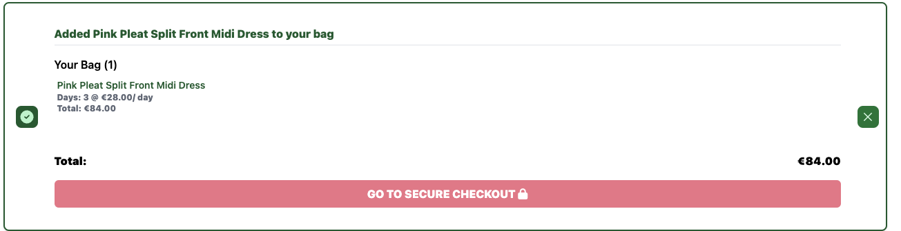

# Atlas Rogue


> [Live Site](https://atlas-rogue-09e759974ffc.herokuapp.com/)

> [Repository](https://github.com/BOM-98/atlas-rogue-project-5)

# Project Background

## Overview

Atlas Rogue is a fashion rental service specializing in women’s clothing in Ireland. Catering primarily to women aged 18-34, Atlas Rogue offers a unique approach by exclusively renting out its own collection of fashionable attire.

The service is designed to provide value and convenience to its customers by offering a broad selection of the latest trends and timeless classics, all available for rent. By maintaining a direct relationship with its customers, Atlas Rogue is able to respond quickly to changing fashion trends and customer preferences, ensuring that its collection remains fresh and relevant. The company leverages exceptional SEO and brand awareness strategies to reach a wide audience, making it easy for customers to find and rent the perfect outfit for any occasion without a hefty price tag.

Atlas Rogue simplifies the fashion rental process, offering a seamless online experience from browsing and selection to rental and return. This direct-to-consumer model not only enhances the shopping experience but also fosters a sense of community among its users, who appreciate the brand's commitment to style, quality, and customer satisfaction.

## Problem Statement

Atlas Rogue addresses the challenge faced by fashion-conscious women aged 18-34 in Ireland who are seeking a sustainable and cost-effective way to access a diverse and trendy wardrobe. Traditional shopping methods often lead to high expenses, closet clutter, and environmental concerns due to fast fashion consumption. Furthermore, the hassle of navigating multiple rental websites to find quality, fashionable clothing items that suit their tastes and needs adds complexity and frustration to the process.

By offering a curated collection of high-quality women's clothing available for rent through a single, user-friendly platform, Atlas Rogue eliminates the need for consumers to buy fast fashion items that are quickly discarded, thus promoting a more sustainable approach to fashion. This service solves the problem of wardrobe diversity without the associated costs and environmental impact, providing a convenient, cost-effective, and eco-friendly solution for staying fashionable.

## Research:


- User Interviews: 1:1 interviews were conducted with existing online fashion rental shoppers to determine the categories they look for, the designers they like and what the pros and cons are of different competing sites in the country. 
- Competitive Analysis: Examining competing rental stores and websites revealed existing offerings and their strengths and weaknesses. This informed our choice of target market, value proposition, messaging and strategy.

## Design

- I began the process by designing wire-frames of the site in order to get an overall understanding of the user flows and necessary pages to achieve the client outcomes.
- I converted the wire-frames into [a figma prototype](https://www.figma.com/file/YWbAEWtNoY8F2MQ9Bu6ytS/Atlas-Rogue-Mockups?type=design&node-id=0%3A1&mode=design&t=QR0umm1zHzCF4fw5-1) to determine the flow, color schemes and typography that would be used.
- The design was then tested with potential customers to ensure they understood the proposition and were able to navigate the prototype without confusion.
- The logo, typeface and colour scheme were chosen to reflect a gentle and kind brand that was not too serious.

<details>
<summary> Colour Palette </summary>


</details>


## Agile Development CHANGE

Agile software development methods were used to deliver this project and ensure that an iterative approach was taken to achieve the best results for the end-user. 
- The project was broken down from the high level business outcomes and problem statement into epics and user stories. 
- The end user's requirements were written from the end user's perspective to help make sure the right features were being built in a user-centric way.

A github projects board was used to track and manage the expected workload involved in this project, and break it down into a list of epics, and then further into user stories that could be worked towards to build the site on time.
- Each user story was written with a clear description following the convention of "As a ____, I want to ______, so that ____".
- A T-shirt sizing system was used to estimate the effort involved with each story (S, M, L, XL).
- The end user goal and end business goal was clearly articulated on each story, along with the acceptance criteria. 
- Each story contained the necessary tasks required to complete them and achieve the acceptance criteria. 
- #### [Link to the GitHub Project board](https://github.com/users/BOM-98/projects/5)


User stories were prioritized using the MoSCow method (Must have, Should have, Could have, Won't have)
- #### [Link to the MoSCow Prioritization Board](https://github.com/users/BOM-98/projects/5/views/3)

Some user stories relating to ratings and reviews, payment options and customer account management for the website were deemed to not be necessary and therefore were not added to the project. This could be added to the project on a future date.


# Business Model

- Atlas Rogue is an online eCommerce store where customers can rent items of clothing online and have them delivered.
- All clothing items were scraped using the product_scraper.py script from a UK website - [ClOAN STORE](https://www.cloan.uk/).


## Marketing

### SEO

- Keyword research was conducted using [Ubersuggest](https://app.neilpatel.com/en/ubersuggest)
- Given this is a fashion rental site for Ireland keyword research was focused on driving traffic from Irish consumers. Therefore, keyword research was focused heavily on local SEO. 
- Research on UberSuggest showed that the following keywords had significant enough monthly traffic to be worth investing effort to rank for, while having a low enough "SEO Difficulty" i.e. competition to be viable options.
- SEO Difficulty (SD) is on a normalised scale from 1-100, with 100 being the hardest. It is recommended for new websites to aim to target keywords with a SD below 40.
- Long tail keywords that include locations e.g. Cork were added to increase the odds of driving traffic from specific areas in Ireland.
- The top keywords chosen were `dress rental ireland`, `rental dresses ireland` & `rent a dress ireland`.
- These keywords were implemented in the H1 & H2 tags, meta descriptions and titles of pages.
- I attempted not to 'overstuff' keywords in my project and aimed to limit the keywords to max 10 mentions per page.
- I did not have any way to specifically call out `rental dresses dublin` as I did not have inventory I could categorise under than heading. Instead, I attempted to mention Dublin in the about us page and link it to the Homepage twice so that the "link juice" flowed to the homepage and at least give a chance of it ranking on the first page of the keyword term.
- Whenever possible, important keywords were bolded to highlight their importance and increase chances of them ranking. 
- The word `dress` was included in the majority of our product names for dresses, therefore I made sure that the image names matched the name of the item and included the item name in the alt attributes of any image to increase our rankings for the word `dress`.
- A `sitemap.xml` and `robot.txt` file was generated and uploaded to the project to inform Google what pages should be indexed and maximize chances of Atlas Rogue ranking for our targeted keywords.

<hr>

| KEYWORD                 | VOLUME | SD |
|-------------------------|--------|----|
| `rental dresses dublin` | 1900   | 29 |
| `dresses to rent dublin`| 1900   | 30 |
| `dress rental dublin`   | 1900   | 30 |
| `rent dresses dublin`   | 1900   | 30 |
| `rent dress dublin`     | 1900   | 30 |
| `rent a dress dublin`   | 1900   | 29 |
| `rent dress ireland`    | 1600   | 22 |
| `dress rental ireland`  | 1600   | 28 |
| `rental dresses ireland`| 1600   | 22 |
| `rent a dress ireland`  | 1600   | 25 |
| `rent dresses ireland`  | 1600   | 28 |
| `dresses to rent ireland`| 1600  | 28 |
| `rental dresses`        | 480    | 21 |
| `dress rental`          | 480    | 22 |
| `rent dresses`          | 480    | 22 |
| `rent a dress`          | 480    | 26 |
| `dresses rental`        | 480    | 21 |
| `dress rentals`         | 480    | 20 |
| `dress rental cork`     | 210    | 30 |


<details>
<summary>Screenshot of Ubersuggest Report</summary>


</details>

<hr>

### Social

- A fictional Facebook business page was set up for the eCommerce store which offers several advantages:

<details>
<summary>Facebook Page Screenshot</summary>


</details>


- Using a Facebook business page to promote Atlas Rogue, offers a multitude of benefits in terms of digital marketing and customer interaction.

  - **Increased Visibility:**
  Broad Audience Reach: Facebook's vast user base provides an unparalleled platform to reach a wide audience globally. This increased visibility can lead to higher brand recognition and potentially more customers.

  - **SEO Benefits:** A well-maintained Facebook page can also enhances our SEO efforts, giving Google signals that this is a legitimate business and providing more trust scores on its EAT criteria to make it more visible in search engine results pages (SERPs) when people search for related keywords.

  - **Customer Engagement:**
  Direct Communication: Facebook allows for real-time interaction with our audience through comments, messages, and posts, fostering a stronger connection between your brand and its followers.

  - **Marketing Opportunities:**
  Targeted Advertising: Facebook's advertising platform enables highly targeted campaigns based on demographics, interests, and behavior, allowing you to reach specific segments of your audience with customized messages.

  - **Content Sharing:** The platform is ideal for sharing a wide range of content, including updates, promotions, educational content, and behind-the-scenes looks, which can engage and inform your audience.

  - **Brand Building:** Consistent Brand Image: A Facebook business page serves as an extension of Atlas Rogue's, allowing us to maintain a consistent brand image and voice across all your marketing channels.

  - **Community Building:** Through features like Facebook Groups, Facebook enables us to foster a community around our Brand or Clothing Rentals in general.

  - **Customer Support:**
  Immediate Response: Facebook messaging is an increasingly more popular channel through which customers contact businesses with queries or complaints.


## Newsletter CHANGE

- A newsletter form is present on the footer of every page, which offers a variety of benefits:

  - **Lead Generation:**
    The newsletter sign-up form serves as a powerful tool for capturing the contact information of potential customers. By encouraging visitors to subscribe, Atlas Rogue can grow its database of leads who have expressed interest in their rental service, laying the groundwork for targeted marketing campaigns and personalized offers.

  - **Direct Communication:**
    Subscribing to the newsletter allows Atlas Rogue to establish a direct line of communication with its audience. This channel can be used to send updates, promotions, exclusive offers, and fashion tips directly to subscribers' inboxes, fostering a stronger connection between the brand and its customers.

  - **Customer Retention:**
    Regular newsletters keep subscribers engaged and informed about the latest additions to the collection, special events, and any loyalty programs. This consistent touchpoint increases the likelihood of subscribers returning to Atlas Rogue for their rental needs, enhancing customer retention.

  - **Traffic and Engagement:**
    Newsletters can drive traffic back to the Atlas Rogue website by featuring captivating content, such as new arrivals, fashion inspiration, and exclusive deals. Increased website visits not only boost engagement but also provide more opportunities for conversions and sales.

  - **Analytics and Insights:**
    Every newsletter campaign offers actionable analytics, such as open rates, click-through rates, and conversion data. Atlas Rogue can use these insights to understand subscriber preferences better, refine marketing strategies, and tailor future content to meet the interests and needs of their audience more effectively.


## Data Models CHANGE

The database schema for the tough glove site is shown below:


<details>
<summary>Orders Model</summary>

### `orders`
- `order_number` varchar(32) [primary key]
- `user_profile_id` integer [null]
- `full_name` varchar(50)
- `email` varchar(254)
- `phone_number` varchar(20)
- `country` varchar
- `postcode` varchar(20) [null]
- `town_or_city` varchar(40)
- `street_address1` varchar(80)
- `street_address2` varchar(80) [null]
- `county` varchar(80) [null]
- `date` timestamp
- `delivery_cost` decimal(6,2)
- `order_total` decimal(10,2)
- `grand_total` decimal(10,2)
- `original_bag` text
- `stripe_pid` varchar(254)

</details>

<details>
<summary>Order Line Items Model</summary>


### `order_line_items`
- `id` integer [primary key]
- `order_id` integer
- `product_id` integer
- `quantity` integer
- `lineitem_total` decimal(6,2)

</details>

<details>
<summary>Product Rentals Model (Custom)</summary>

### `product_rentals`
- `id` integer [primary key]
- `product_id` integer
- `order_line_item_id` integer
- `start_date` date
- `end_date` date

</details>

<details>
<summary>User Profiles Model</summary>

### `user_profiles`
- `id` integer [primary key]
- `user_id` integer
- `default_phone_number` varchar(20) [null]
- `default_street_address1` varchar(80) [null]
- `default_street_address2` varchar(80) [null]
- `default_town_or_city` varchar(40) [null]
- `default_county` varchar(80) [null]
- `default_postcode` varchar(20) [null]
- `default_country` varchar(40) [null]

</details>

<details>
<summary>Contacts Model (Custom)</summary>

### `contacts`
- `id` integer [primary key]
- `name` varchar(100)
- `email` varchar(254)
- `subject` varchar(150)
- `message` text
- `created_at` timestamp

</details>

<details>
<summary>Categories Model</summary>

### `categories`
- `id` integer [primary key]
- `name` varchar(254)
- `friendly_name` varchar(254) [null]

</details>

<details>
<summary>Products Model</summary>

### `products`
- `id` integer [primary key]
- `category_id` integer [null]
- `sku` varchar(254) [null]
- `name` varchar(254)
- `designer` varchar(254) [null]
- `price` decimal(6,2)
- `rrp` decimal(6,2) [null]
- `size` varchar(254) [null]
- `colour` varchar(254) [null]
- `length` varchar(254) [null]
- `image_url` varchar(1024) [null]
- `image` varchar [null] 

</details>

<details>
<summary>Wishlist Model (Custom)</summary>

### `wishlists`
- `id` integer [primary key]
- `user_profile_id` integer

</details>


# Features

## CRUD functionality:

### Member CRUD Functionality
- Create:
  - Users can create a `User` with an associated `User Profile` on the register page
  - Users can create `Orders`, `Product Rentals` & `Order Line Items` for a rental item through the checkout
  - Users can create `Wishlist` items by clicking the wishlist button on products
  - Users can create `Contacts` through the contact us form on the contact page
- Read: 
  - Users can read their `Orders`, `Product Rentals` & `Order Line` Items information on their profile page in Order History
  - Users can read all `Wishlist` items in their account
  - Users can read all `Products` and `Categories` through the products and product details pages
- Update: 
  - Users can update the `User` account with the profile page and form
### Admin CRUD Functionality
- Create:
  - Admins can create `Products` through the product management page
- Read: 
  - Admins can read all of the `Contacts` that have been submitted by users on the Contact Form Submissions page
- Update: 
  - Admins can update `Products` on the site by clicking the edit button under any product in the products or product_detail pages
- Delete:
  - Admins can delete `Products` from the site by clicking the delete button under any product in the products or product_detail pages


## Authentication / Authorization:

Certain access restrictions were put in place across the website. 

### No Login Required

- Homepage is viewable by everyone 

### Must Be Logged Out To View

Only users who are not logged in can view:
- The registration page to register an account
- The login page to login to their account

If a user is logged in and navigates to these pages they should be redirected to the homepage


### Login Required:

Logins are required on a user account in order to access these pages:
- Profile page - `profile.html`
- Wishlist page - `wishlist.html`

### User Authentication
- Users are only able to see Orders that they have made - `checkout_success.html`

### Admin Only Access: 

Only users logged in with an admin account can access these pages:

- Add Product page - `add_product.html`
- Update Product page - `edit_product.html`
- Contact Form Submissions page - `contact_form_submissions.html`

## General Features:

### Navigation & Footer

- A primary navigation is present on the header on all pages of the website. The top navigation is entirely custom built to fit with the style and design of the brand and **does not use any other pre-built components from other libraries**. 

- If a user is logged in as an admin, the user has access to all available navigation links including Product Management and Contact Form Submissions which are not available to regular users

<details>
<summary>Screenshot of Admin Navigation</summary>


</details>
<br>

- If the user is logged in as a regular customer, the user has access to their profile, cart, wishlist and all standard navigation links. 

<details>
<summary>Screenshot of Member Navigation</summary>


</details>
<br>

- The navigation collapses into a burger menu on mobile screens
<details>
<summary>Screenshot of Collapse Menu</summary>


</details>
<br>

The footer is present on all screens of the website and follows the same conditional login for presenting links as the primary navigation

<details>
<summary>Footer Navigation</summary>


</details>
<br>

### Homepage

The homepage acts as an advertising front for any visitors who are not currently members. The copy on the homepage will be optimised for SEO keywords to win search traffic from people searching for dress rentals in Ireland.

<details>
<summary>Screenshots of The Homepage</summary>


</details>

### Login & Register

Login and register pages were implemented to manage user signups and contact/delivery details.

The website collects `email`, `username` and `password` through the registration form. 

Form validation ensures that no username can be used twice.

<details>
<summary>Screenshot of The Register Form</summary>


</details>
<br>
<details>
<summary>Screenshot of The Login Form</summary>


</details>

### Error Pages

A custom error page was added to handle 400 errors. 

<details>
<summary>Screenshot of The 404 Page</summary>


</details>

## Admin Features:

### Add Products

Admin users can add products to the website through the `add products` tab.

<details>
<summary>Screenshot of the Add Products Tab</summary>


</details>

### Edit & Delete Products

Admin users can update and delete links from their account seen on the the `products` and `product_detail` pages.

<details>
<summary>Screenshot of the products page with update & delete links</summary>


</details>

### Contact Form Submission Views

Admin users can view their contact form submissions from the Contact Form Submissions page. Submissions are presented as a table. 

<details>
<summary>Screenshot of the Form Submissions Page</summary>


</details>


## Customer Features: 

All customers can see the following pages

### Products Page

Customers can browse all products in our inventory through `products.html`. Customers can search for products by keyword in the search bar in the navigation or filter/sort products by using the tabs across the top of the page. 

<details>
<summary>Screenshot of The Products Page</summary>


</details>

### Products Detail Page

Customers can see a more detailed view of their products through the `products_detail.html` page. Here customers can view the `designer`, `name`, `price` (daily), `RRP`, `size`, `color` and `length` of each item. They can select their rental period using the datetime pickers on the page and add their items to the cart.

Datetime pickers have form validation implemented to ensure they are inputted. Datetime pickers also prevent users from selecting impossible dates including dates earlier than today and setting an end date that is before the start date.

<details>
<summary>Screenshot of The Product Detail Page</summary>


</details>

### Add To Cart Toast

Customers receive a success notification with an update on items in their cart whenever they add a new item to their bag.

<details>
<summary>Screenshot of Add To Cart Toast</summary>



</details>

### Cart

Customers view, edit and delete all items they have in their cart. Their cart also gives them up-to-date information on the number of items they have, the rental periods and days rented, their shipping fee and their grand total. 

<details>
<summary>Screenshot of Cart</summary>


</details>

### Checkout

Customers are prompted to enter or confirm their personal information, including name, email, and contact number. If the customer is already logged in, this information can be auto-filled from their account details.

A secure Stripe payment gateway is integrated, allowing customers to enter their payment details with confidence.

Form validation is implemented to ensure all fields are inputted before completing the order.

<details>
<summary>Screenshot of Checkout</summary>


</details>

### Order Confirmation

Upon successful completion of their checkout customers receive an order confirmation.

<details>
<summary>Screenshot of Confirmation</summary>


</details>

### Contact Form

Customers can contact Atlas Rogue through our contact form, reachable from the top navigation and the footer. The form includes `name`, `email`, `subject` and `message` fields. 

<details>
<summary>Screenshot of Contact Form</summary>


</details>

### Customer Profile

Customers can view and update their profile information, along with their order history, from the Profile page. The profile contains update functionality to add profile information in addition to reading their Order history. 

<details>
<summary>Screenshot of Profile Page</summary>


</details>

### Wishlist

Customers who are logged into an account can add items to their wishlist which is viewable from the Wishlist page. To add items customers click the heart icons next to any product and can then navigate to the wishlist page by clicking the heart in the top navigation. On the wishlist page customers can proceed to remove items from their wishlist by clicking the now 'full' heart icon or they can proceed to add them to their cart.

<details>
<summary>Screenshot of Wishlist</summary>


</details>

## Roadmap CHANGE

### Social Media Logins

It is intended to add functionality to allow members register and login using social media authentication from google and meta. This would significantly reduce the friction on sign-up for new members and improve the conversion rate of web visitors to members. 

### Google Calendar Integration

It is intended to add calendar events to the personal calendars of members of the gyms when they book classes. This would help remind members of upcoming classes and has built in functionality to remind members when classes are upcoming. 

### Google Maps Integrations

Tough Glove is moving to a new gym address. Once that address is secured I will be adding a location for the gym to the site. This will help Tough Glove to rank higher on local SEO and inform interested web visitors where the gym is. 

### Implement A Blog 

Tough Glove wants to stand out as a voice of authority in Dublin on the topic of boxing training. Informational blog posts will add an element of credibility to the company and also help Tough Glove rank higher on Google/Bing for targeted keywords. 

### Implement Recurring Classes & Archive Finished Classes

Currently the gym owners are only able to schedule one off classes. I want to add functionality to allow the gym owner to schedule recurring classes that repeat for 28 days from the current date. Classes that have already occurred are still displayed on the admin dashboard and classes page. I want to archive finished classes as they are no longer relevant and should not be taking up space on the site. 

### Alerts If Two Classes Are Made At The Same Time

The gym owner wanted to maintain the ability to schedule two classes at the same time in case two different trainers were taking different classes. However, I intend to add an alert that notifies the admin if this is happening as they are creating the second class to avoid situations were this may still be done unintentionally. I have however added a constraint so that two classes can't have the same date, start time AND end time to demonstrate the capability to restrict on the server side classes made with the exact same information. 

### Password Reset

Currently members can't reset their passwords in case they forget them. I will need to add a password reset option for the admin and members that sends verification emails to their registered email address. 

# Bugs CHANGE

## Bug 1: 


## Bug 2: 


## Bug 3: 


## Bug 4: Django testing was not allowed to create new tables in elephant sql

When running my tests for my program I was getting errors as my test suite did not have permission to create tables in elephant sql. To resolve this issue, I had to change my settings to instruct the program to use the default sqlite3 backend for running the tests.

```
DATABASES = {
    'default': dj_database_url.parse(os.environ.get("DATABASE_URL"))
}

if 'test' in sys.argv:
    DATABASES = {
        'default': {
            'ENGINE': 'django.db.backends.sqlite3',
            'NAME': 'mydatabase',
        }
    }
```


# Technologies Used CHANGE

I outline the different technologies involved in this project and the purpose for using each technology in this section.

## Core Technologies CHANGE

- [Django](https://www.djangoproject.com/) the full stack framework used for this gym management system.
- [JavaScript](https://www.ecma-international.org/publications-and-standards/standards/ecma-262/) used for rendering the fullcalendar calendar in the app.
- [HTML](https://html.spec.whatwg.org/)/[CSS](https://www.w3.org/Style/CSS/Overview.en.html) + [Django Template Language](https://docs.djangoproject.com/en/4.2/ref/templates/language/) used for building templates on the website and rendering data from the database on the webpages.

## Frameworks and Packages CHANGE


- [Tailwind](https://tailwindcss.com/) - CSS library used to style the site.
- [Flowbite](https://flowbite.com/) - Tailwind CSS component library.
- [jQuery](https://jquery.com/) - JavaScript library for document transversal and manipulation.


## Django Packages CHANGE

- [Gunicorn](https://pypi.org/project/gunicorn/) - provides HTTP server.
- [psycopg2](https://pypi.org/project/psycopg2/) - provides PostgreSQL connection.
- [Whitenoise](https://pypi.org/project/whitenoise/) - used for serving static files.
- [Coverage](https://pypi.org/project/coverage/) - used for testing and analysis.
- [django-bootstrap-datepicker-plus](https://django-bootstrap-datepicker-plus.readthedocs.io/en/latest/Usage.html) - datepicker plugin used for selecting times and dates for classes being made. 
- [Black](https://pypi.org/project/black/) - A PEP8 compliant code formatter.


## Deployment Technologies CHANGE

- [PostgreSQL](https://www.postgresql.org/) (via Elephant SQl) - used for database.
- [Heroku](https://www.heroku.com/) - used for hosting the application.
- [Cloudinary](https://cloudinary.com/) - Image API platform for delivering images via CDN.
- [Github](https://github.com/) - code repository for storing the codebase and version control

# Testing CHANGE

## Automatic Testing

Automatic unit tests were written for the Layout back-end functionality of the app to test all of the templates, forms, models and views of the site.

- 54 Unit Tests were written in total

### Form Tests

- All forms were tested in `test_forms.py` for appropriate form validation and to ensure the integrity of all of the data written to the database.

<details>
<summary>List of Form Unit Tests</summary>

 Test      | Result |
| ----------- | ----------- |
| CREATEUSERFORM is valid if no fields are excluded     | OK      |
| CREATEUSERFORM is invalid if no FIRST_NAME field is inputted   | OK       |
| CREATEUSERFORM is invalid if no USERNAME field is inputted   | OK       |
| CREATEUSERFORM is invalid if no EMAIL field is inputted   | OK       |
| CREATEUSERFORM is invalid if a duplicate USERNAME field is inputted  | OK       |
| CREATEUSERFORM is valid if a duplicate EMAIL field is inputted  | OK       |
| CREATEUSERFORM is invalid if the PASSWORD1 and PASSWORD2 fields are different  | OK       |
| UPDATEUSERFORM is valid if no fields are excluded  | OK       |
| UPDATEUSERFORM is invalid if no FIRST_NAME field is inputted  | OK       |
| UPDATEUSERFORM is invalid if no LAST_NAME field is inputted  | OK       |
| UPDATEUSERFORM is invalid if no USERNAME field is inputted  | OK       |
| UPDATEUSERFORM is invalid if no EMAIL field is inputted  | OK       |
| CREATECLASSFORM is valid if no fields are excluded  | OK       |
| CREATECLASSFORM is invalid if no CLASS_TYPE field is inputted  | OK       |
| CREATECLASSFORM is invalid if no CLASS_DATE field is inputted.  | OK       |
| CREATECLASSFORM is invalid if no CLASS_START_TIME field is inputted  | OK       |
| CREATECLASSFORM is invalid if no CLASS_END_TIME field is inputted  | OK       |
| CREATECLASSFORM is invalid if no SLOTS_AVAILABLE field is inputted  | OK       |
| UPDATECLASSFORM is valid if no fields are excluded  | OK       |
| BOOKINGFORM is valid if no fields are excluded  | OK       |
| BOOKINGFORM is invalid if no USER field is inputted  | OK       |
| BOOKINGFORM is invalid if no CLASS_ID field is inputted  | OK       |
| CREATECLASSFORM is invalid if no SLOTS_AVAILABLE field is inputted  | OK       |
</details>

<br>

### Models Tests CHANGE

- Models are tested in `test_models.py` to check that models created the correct instances in the system


#### Class Model Tests:

<details>
<summary>Class Model Unit Tests</summary>

| Test Description                                | Action                                                               | Expected Outcome       |
| ----------------------------------------------- | -------------------------------------------------------------------- | ---------------------- |
| Test Class Creation                             | Verify the class instance has correct initial settings.              |                        |
| \- `class_name` is 'Test Class'                 | Check the `class_name` attribute.                                    | Pass                   |
| \- `slots_available` is set to 10               | Check the `slots_available` attribute.                               | Pass                   |
| \- `slots_filled` starts at 0                   | Check the `slots_filled` attribute.                                  | Pass                   |
| Unique Together Constraint                      | Ensure class uniqueness based on date and time.                      |                        |
| \- Attempt to create a duplicate class instance | Try creating a class with the same date and time as an existing one. | Exception raised, pass |

</details>

<br>

#### Booking Model Tests:

<details>
<summary>Booking Model Unit Tests</summary>

| Test Description                            | Action                                                       | Expected Outcome |
| ------------------------------------------- | ------------------------------------------------------------ | ---------------- |
| Test Booking Creation                       | Verify the booking instance is correctly created and linked. |                  |
| \- `user` is linked to `other_user`         | Check the `user` attribute.                                  | Pass             |
| \- `class_id` is linked to `class_instance` | Check the `class_id` attribute.                              | Pass             |

</details>

<br>

#### Class Slot Management Tests:

<details>
<summary>Slot Management Unit Tests</summary>

| Test Description                                        | Action                                                     | Expected Outcome |
| ------------------------------------------------------- | ---------------------------------------------------------- | ---------------- |
| Test Decrement Slots                                    | Validate the update of slot availability and filled slots. |                  | Pass
| \- After booking deletion, `slots_available` increments | Delete a booking and check `slots_available`.              | Pass             |
| \- After booking deletion, `slots_filled` decrements    | Delete a booking and check `slots_filled`.                 | Pass             |Pass             | 

</details>

<br>

### Views Tests

- Views are tested in `test_views.py` to ensure HTTP status codes, templates used and forms all performed as expected. 

#### Registration and Login Tests:

<details>
<summary>Registration and Login Unit Tests</summary>

| Test Case         | Description                                                                                 | Outcome |
| ----------------- | ------------------------------------------------------------------------------------------- | ------- |
| Homepage View     | Confirms that the homepage view uses the correct template and returns a status code of 200. | Pass    |
| Register View     | Checks the registration page is displayed correctly with the appropriate template.          | Pass    |
| User Registration | Ensures that a new user can register successfully and is redirected to the login page.      | Pass    |
| Login View        | Validates the login page is displayed correctly with the appropriate template.              | Pass    |
| User Login        | Confirms that a user can log in successfully and is redirected to the homepage.             | Pass    |
</details>
<br>

#### Member Views Tests:

<details>
<summary>Member Views Unit Tests</summary>

| Test Case                   | Description                                                                             | Outcome |
| --------------------------- | --------------------------------------------------------------------------------------- | ------- |
| Logout View                 | Tests if a user can logout successfully and is redirected to the homepage.              | Pass    |
| Available Classes View      | Ensures that the list of available classes is retrieved successfully.                   | Pass    |
| Profile View                | Checks that the user profile page is displayed correctly and uses the correct template. | Pass    |
| Update Member View          | Confirms that the member update page is accessible and uses the correct template.       | Pass    |
| Update Profile              | Ensures that a user can update their profile and is redirected to the profile page.     | Pass    |
| Unauthorized Profile Update | Verifies that a user cannot update another user's profile unless they are an admin.     | Pass    | Pass    |
</details>
<br>

#### Admin Views Tests:

<details>
<summary>Admin Views Unit Tests</summary>

| Test Case            | Description                                                                     | Outcome |
| -------------------- | ------------------------------------------------------------------------------- | ------- |
| Members View         | Tests if the admin can view the list of members.                                | Pass    |
| Update Other Profile | Checks that an admin can update other member profiles.                          | Pass    |
| Delete Member View   | Confirms that the admin can access the delete member page.                      | Pass    |
| Delete Profile       | Ensures that an admin can delete a member's profile.                            | Pass    |
| Admin Dashboard View | Validates that the admin dashboard is accessible and uses the correct template. | Pass    |
</details>
<br>

#### Classes Views Tests:

<details>
<summary>Classes Views Unit Tests</summary>

| Test Case         | Description                                                               | Outcome |
| ----------------- | ------------------------------------------------------------------------- | ------- |
| Create Class View | Confirms that the class creation page is displayed correctly.             | Pass    |
| Create Class      | Ensures that an admin can create a class successfully.                    | Pass    |
| Update Class View | Checks that the class update page is displayed correctly.                 | Pass    |
| Update Class      | Verifies that an admin can update class details.                          | Pass    |
| Delete Class View | Tests if the class deletion page is displayed correctly.                  | Pass    |
| Delete Class      | Confirms that an admin can delete a class.                                | Pass    |
| Classes View      | Ensures that the classes list page is accessible and displayed correctly. | Pass    |
</details>
<br>

#### Bookings Views Tests:

<details>
<summary>Bookings Views Unit Tests</summary>

| Test Case           | Description                                                                   | Outcome |
| ------------------- | ----------------------------------------------------------------------------- | ------- |
| Bookings View       | Validates that the bookings page is accessible and uses the correct template. | Pass    |
| Book Class View     | Checks that the class booking page is displayed correctly.                    | Pass    |
| Book Class          | Confirms that a user can book a class successfully.                           | Pass    |
| Cancel Booking View | Tests if the cancel booking page is displayed correctly.                      | Pass    |
| Cancel Booking      | Ensures that a user can cancel a booking successfully.                        | Pass    |
</details>
<br>

### Automated Test Results: 


### Coverage Report: 

Overall I managed to gain 94% coverage on my layout app as seen in the image below. 


## Manual Testing

### General Tests

| Test                                  | Action                                                                                       | Result |
| ------------------------------------- | -------------------------------------------------------------------------------------------- | ------ |
| URL loads                             | Enter the website URL into a browser and press Enter.                                        | PASS   |
| Page loads in under 3 seconds         | Measure the load time of the page from the moment the URL is entered.                        | PASS   |
| Navigation links all work             | Click each navigation link in the header and verify it directs to the correct page.          | PASS   |
| All CTA Links work                    | Click each Call to Action (CTA) link and verify it performs the expected action.             | PASS   |
| All footer navigation links work      | Click each navigation link in the footer and verify it directs to the correct page.          | PASS   |
| Social link opens to a different page | Click each social media link and verify it opens the correct social media page in a new tab. | PASS   |

### Homepage Testing

| Test                                  | Action                                                                                     | Result |
| ------------------------------------- | ------------------------------------------------------------------------------------------ | ------ |
| Logo link works                       | Click on the website's logo to ensure it redirects to the homepage.                        | PASS   |
| Page loads in under 3 seconds         | Time the page load from when the URL is entered to when the page is fully loaded.          | PASS   |
| Navigation links all work             | Test each navigation link in the site's menu to confirm they lead to the correct pages.    | PASS   |
| All CTA Links work                    | Click on each Call to Action button/link and check it leads to the expected response/page. | PASS   |
| All footer navigation links work      | Verify each link in the footer to ensure they navigate to the correct sections or pages.   | PASS   |
| Social link opens to a different page | Click the social media icons and check if they open the correct profiles in new tabs.      | PASS   |

### Login & Register Page Testing

| Forms create a new user                          | Complete and submit the registration form with valid details.                              | PASS |
| ------------------------------------------------ | ------------------------------------------------------------------------------------------ | ---- |
| Form validation prevents missing fields          | Submit forms with some fields left blank to test required field validation.                | PASS |
| Form validation prevents duplicate users         | Attempt to register a user with a username or email that already exists.                   | PASS |
| Password validation prevents easy passwords      | Try to create a user with common passwords to test the strength validation.                | PASS |
| Password confirmation prevents mismatched fields | Enter mismatched passwords in the 'password' and 'confirm password' fields.                | PASS |
| User can login with a valid account              | Attempt to login with correct user credentials.                                            | PASS |
| User can't login with an invalid account         | Attempt to login with incorrect user credentials.                                          | PASS |
| Error messages for invalid forms display         | Submit invalid forms to ensure that appropriate error messages are displayed.              | PASS |
| Login link on register form redirects            | Click the login link on the registration form to ensure it redirects to the login page.    | PASS |
| Register link on login form redirects            | Click the register link on the login form to ensure it redirects to the registration page. | PASS |
| All footer navigation links work                 | Click each navigation link in the footer and verify it directs to the correct page.        | PASS |

### Admin Page Testing

| Test                                                | Action                                                                                                | Result |
| --------------------------------------------------- | ----------------------------------------------------------------------------------------------------- | ------ |
| Create a class link works                           | Click the "Create a Class" link and verify it opens the class creation form.                          | PASS   |
| Create a member link works                          | Click the "Create a Member" link and verify it opens the member creation form.                        | PASS   |
| Class Deletion button deletes class                 | Use the delete button on a class entry and verify the class is removed from the database.             | PASS   |
| User must confirm class deletions                   | Attempt to delete a class and verify that a confirmation prompt is displayed.                         | PASS   |
| Member Deletion button deletes members              | Use the delete button on a member entry and verify the member is removed from the database.           | PASS   |
| User must confirm member deletions                  | Attempt to delete a member and verify that a confirmation prompt is displayed.                        | PASS   |
| Class Update button redirects to update form        | Click the "Update" button for a class and verify redirection to the update form.                      | PASS   |
| Member Update button redirects to update form       | Click the "Update" button for a member and verify redirection to the update form.                     | PASS   |
| Class calendar displays all classes in the database | Verify that the class calendar shows all scheduled classes.                                           | PASS   |
| Class calendar month, week, day and list views work | Test different views (month, week, day, list) in the class calendar to ensure they display correctly. | PASS   |
| Class calendar Renders (JAVASCRIPT TEST) | Load the webpage to ensure the javascript renders the calendar on page load. | PASS   |

### Members Page

| Test                                           | Action                                                                                          | Result |
| ---------------------------------------------- | ----------------------------------------------------------------------------------------------- | ------ |
| Create New Member Link Works                   | Click the "Create New Member" link to ensure it directs to the new member creation form.        | PASS   |
| All User Actions Work                          | Verify that all user actions (update & delete) function as intended.                | PASS   |
| Update User Link Works                         | Click the "Update User" link for a member to check if it redirects to the user update form.     | PASS   |
| Delete User Link Works                         | Use the "Delete User" link or button for a member to confirm it initiates the deletion process. | PASS   |
| Total Users Column Correctly Tallies the Users | Confirm that the "Total Users" column presents an accurate count of all users.                  | PASS   |


### Classes Page

| Test                                          | Action                                                                                                      | Result |
| --------------------------------------------- | ----------------------------------------------------------------------------------------------------------- | ------ |
| Create a Class Button Works                   | Click the "Create a Class" button to ensure it leads to the class creation form.                            | PASS   |
| All Class Actions (Update, Delete, Book) Work | Test each action button for a class to confirm that update, delete, and book operations function correctly. | PASS   |
| Classes Count Correctly Tallies the Classes   | Verify the total count of classes listed matches the actual number of classes in the system.                | PASS   |
| Slots Available Counts the Correct Numbers    | Check that the "Slots Available" count reflects the correct number of available slots per class.            | PASS   |
| Slots Booked Counts the Correct Numbers       | Confirm that the "Slots Booked" count accurately represents the number of slots booked.                     | PASS   |
| Class calendar displays all classes in the database | Verify that the class calendar shows all scheduled classes.                                           | PASS   |
| Class calendar month, week, day and list views work | Test different views (month, week, day, list) in the class calendar to ensure they display correctly. | PASS   |
| Class calendar Renders (JAVASCRIPT TEST) | Load the webpage to ensure the javascript renders the calendar on page load. | PASS   |

### My Bookings

| Test                                      | Action                                                                                        | Result |
| ----------------------------------------- | --------------------------------------------------------------------------------------------- | ------ |
| Correctly Displays Bookings for User      | Check that the user's bookings are correctly displayed on their booking page.                 | PASS   |
| Cancel Button on Bookings Works           | Click the "Cancel" button on a booking to ensure it initiates the cancellation process.       | PASS   |
| Bookings Total Column is Correct          | Verify that the "Bookings Total" column sums up the correct total number of bookings made.    | PASS   |
| Booking Page Title Displays the User Name | Ensure that the booking page title includes the user's name, indicating personalized content. | PASS   |

### Profile

| Test                                       | Action                                                                                               | Result |
| ------------------------------------------ | ---------------------------------------------------------------------------------------------------- | ------ |
| First Name is Correct                      | Verify that the displayed first name matches the user's actual first name.                           | PASS   |
| Last Name is Correct                       | Confirm that the displayed last name matches the user's actual last name.                            | PASS   |
| Username is Correct                        | Check that the displayed username is accurate according to the user's profile data.                  | PASS   |
| Email is Correct                           | Ensure the displayed email address is the one associated with the user's account.                    | PASS   |
| Bookings Count is Correct                  | Confirm that the number displayed in the bookings count reflects the actual number of bookings made. | PASS   |
| See Bookings Link Directs to Bookings Page | Click on the "See Bookings" link and check if it redirects to the user's bookings page.              | PASS   |
| Edit Button Directs to Update User Page    | Use the "Edit" button and verify redirection to the user's profile update page.                      | PASS   |
| Log Out Button Logs the User Out           | Click the "Log Out" button and confirm that it successfully logs the user out of the system.         | PASS   |

## Pagespeed Insights Report CHANGE

Pagespeed Insights & Lighthouse testing revealed near perfect results for the performance of the website across all dimensions.

<br>

> homepage.html


<details>
<summary>Pages Tested List:</summary>

- create_member.html
- delete_member.html
- login.html
- members.html
- profile.html
- register.html
- update_member.html
- book_classes.html
- cancel_booking.html
- classes.html
- delete_class.html
- update_class.html
- user_bookings.html
- admin_dashboard.html
- available_classes.html
- homepage.html
- 400.html
- 403.html
- 404.html
- 500.html

</details>

## Responsiveness Testing CHANGE

- ResponsivelyApp and Chrome Dev Tools were used to test responsiveness.
- The website underwent comprehensive testing in both portrait and landscape orientations across a variety of simulated mobile, tablet, and large format screen sizes.
- All pages were tested across browsers for full responsiveness. 

<br>
<details>
<summary>Homepage Responsive Checking</summary>


</details>

<br>
<details>
<summary>Admin Responsive Checking</summary>


</details>

## Code Validation

### HTML

All HTML code was put through the [W3 HTML Validator](https://validator.w3.org/nu/) and passed.
<br>

> homepage.html

<details>
<summary>Pages Checked List:</summary>

- create_member.html
- delete_member.html
- login.html
- members.html
- profile.html
- register.html
- update_member.html
- book_classes.html
- cancel_booking.html
- classes.html
- delete_class.html
- update_class.html
- user_bookings.html
- admin_dashboard.html
- available_classes.html
- base.html (was checked on every instance of every other page with page source code inputted into the validator)
- homepage.html
- 400.html
- 403.html
- 404.html
- 500.html

</details>

### CSS

All CSS code was put through the [W3 CSS Validator](https://jigsaw.w3.org/css-validator/) and passed.
<br>

> style.css

<details>
<summary>Pages Checked List:</summary>

- style.css
- homepage.css
- admin.css

</details>

### Python

All python code was put through the [Code Institute Python Linter](https://pep8ci.herokuapp.com/#) and passed

<br>

> forms.py


<details>
<summary>Pages Checked List:</summary>

- decorators.py
- forms.py
- models.py
- test_forms.py
- test_models.py
- test_views.py
- views.py


</details>

<br>

### Javascript

Calendar.js code was put through the [https://www.jsvalidator.com](jsvalidator.com) and returned no errors.

<br>

# Deployment CHANGE

### ElephantSQL Database

> This project uses [ElephantSQL](https://www.elephantsql.com) for the PostgreSQL Database.

To obtain your own Postgres Database, sign-up with your GitHub account, then follow these steps:
- Click **Create New Instance**.
- Provide the name of your project e.g. `Tough-Glove`
- Select the **Tiny Turtle (Free)** plan.
- Choose your **Data Center** e.g. `eu-west-1 (Ireland)` 
- Click "Review"
- Once you have checked your details, click "Create Instance"
- Once created, click on the new database name, where you can view the database URL and Password.
 - On the details page of your Instance, copy the URL beginning with `postgres://` and Paste your ElephantSQL url in your env.py file
 - Make sure to include your URL in your Heroku app settings as outlined in the Heroku section below

### Cloudinary 

> This project uses the [Cloudinary API](https://www.cloudinary.com) to store static files

To set up a Cloudinary API follow these steps:
- Sign up or login to Cloudinary
- Your Cloudinary Dashboard provides access to your API Environment Variable, which you can copy.
- Important: Exclude 'CLOUDINARY_URL=' from the API value, as this represents the key
- Paste your Cloudinary url in your env.py file
- Make sure to include your URL in you Heroku app settings as outlined in the next section


### Heroku

> This project uses [Heroku](https://www.heroku.com)

To deploy to Heroku I followed these steps: 

- Sign up or login on Heroku
- Create a new app in Heroku by selecting "New" and "Create New App" from the admin dashboard homepage
- Choose your name e.g. `tough-glove` as the name for the project and chose your region e.g. `EU`
- Confirmed creation of a new app
- Navigate to the submenu in the navigation bar and select "resources"
- From here I was redirected to the Deploy tab
- Navigate to Settings and click the "Reveal Config Vars" button
- Create a new Key Value pair with the key of "CLOUDINARY_URL" and the value of the Cloudinary url in the .env file of the app repository
- Create a second Key Value pair with the key of "DATABASE_URL" and the value of the Elephant SQL url in the .env file of the app repository
- Create a third Key Value pair with a value of "SECRET_KEY" and the value of the SECRET_KEY variable in your .env file of the app repository
- Create one more Key Value pair with the value of PORT and a Key of 8000

| Key | Value |
| --- | --- |
| `CLOUDINARY_URL` | user's own value |
| `DATABASE_URL` | user's own value |
| `DISABLE_COLLECTSTATIC` | 1 (*this is temporary, and can be removed for the final deployment*) |
| `SECRET_KEY` | user's own value |
| `PORT` | 8000 |

- Heroku needs two additional files in order to deploy properly.
  - requirements.txt
  - Procfile

>You can install this project's requirements (where applicable) using:
>
>pip3 install -r requirements.txt
>If you have your own packages that have been installed, then the requirements file needs >updated using:

>pip3 freeze --local > requirements.txt
>The Procfile can be created with the following command:

>echo web: gunicorn app_name.wsgi > Procfile
>replace app_name with the name of your primary Django app name; the folder where settings.py is located

- In the Settings tab, ensure that the Python Buildpack is added.
- In the Deploy tab, enable automatic deploys from the Github repository
- Click "Deploy Branch" to deploy the app
- Once the app has been built, click "open app" in the top right corner to test deployment


### Local Deployment

#### Forking the repository

By forking the GitHub Repository you can make a copy of the original repository to view or change without it effecting the original repository.
You can do this by: 
-  Logging into GitHub or create an account. 
- Locate the repository at  [here](https://github.com/BOM-98/tough-glove-project-4)  . 
-  At the top of the repository, on the right side of the page, select "Fork" from the buttons available. 
-  A copy of the repository should now be created in your own repository.

#### Create a clone of this repository

Creating a clone enables you to make a copy of the repository at that point in time - this lets you run a copy of the project locally: This can be done by:

-   Navigate [Here](https://github.com/BOM-98/tough-glove-project-4)
-   click on the arrow on the green code button at the top of the list of files
-   select the clone by https option and copy the URL it provides to the clipboard
-   navigate to your code editor of choice and within the terminal change the directory to the location you want to clone the repository to.
-   type 'git clone' and paste the https link you copied from github
-   press enter and git will clone the repository to your local machine

#### Requirements

For local deployment, you will need to create a .env file in the root directory of the project and set the environment variables in this file.
You will need to define the following variables:

| Key | Value |
| --- | --- |
| `CLOUDINARY_URL` | user's own value |
| `DATABASE_URL` | user's own value |
| `SECRET_KEY` | user's own value |

<br>

# Credits CHANGE

## Courses & Tutorials
- Denis Ivy Youtube tutorials were used to learn how to create a django project. Specifically, this Youtube Series was used to learn the ropes of Django - [Denis Ivy Youtube Series](https://www.youtube.com/watch?v=xv_bwpA_aEA&list=PL-51WBLyFTg2vW-_6XBoUpE7vpmoR3ztO)

- This Codecademy Skill Path was used to learn the ins and outs of Django concepts [Codecademy Course](https://www.codecademy.com/learn/paths/build-python-web-apps-with-django)

- Organising project boards - [Youtube video describing project boards](https://www.youtube.com/watch?v=C0RTISXqyAk)

## Articles & Guides

- [Setting up the project boards, issues and milestones](https://www.topcoder.com/thrive/articles/project-management-on-github)
- [Design and layout of the registration form](https://epicbootstrap.com/snippets/registration)
- [Design and layout of the members list page](https://www.bootdey.com/snippets/view/new-customer-list#css)
- [Datepicker](https://github.com/monim67/django-bootstrap-datepicker-plus/blob/master/README.rst#usage)
- [Django signals](https://docs.djangoproject.com/en/4.2/topics/signals/)
- Creating cancel buttons that don’t post [John Harbison's Blog](http://johnharbison.net/make-a-form-a-cancel-button)
- [Stack Overflow Discussion](https://stackoverflow.com/questions/17678689/how-to-add-a-cancel-button-to-deleteview-in-django)
- [Fullcalendar](https://www.jsdelivr.com/package/npm/fullcalendar)
- [Carousel](https://getbootstrap.com/docs/5.0/components/carousel/)
- [Setting fields to required](https://stackoverflow.com/questions/7682804/django-model-forms-setting-a-required-field)
- [Guide on creating docstrings](https://realpython.com/documenting-python-code/#documenting-your-python-code-base-using-docstrings)
- [Securing against unauthorized access](https://www.codu.co/articles/securing-django-views-from-unauthorized-access-npyb3to_)
- [Types of assertions](https://docs.python.org/3/library/unittest.html)
- [Testing specifically in Django](https://docs.djangoproject.com/en/4.2/topics/testing/)


## Code Examples & Templates
- [Custom 404](https://www.makeuseof.com/create-custom-404-error-page-django/): The template for 404 pages
- [Admin Dashboard](https://github.com/startbootstrap/startbootstrap-sb-admin-2): This codebase was used as inspiration and was heavily customized to suit the needs of this project

## Acknowledgements

- I would like to thank my Code Institute mentor, Lauren Nicole Poppich for her support throughout the development of this project and her invaluable advice.